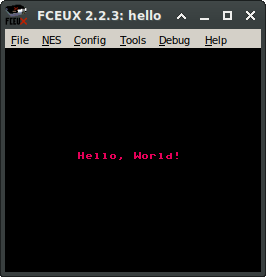

# "Hello, World!" for the Nintendo Entertainment System
If you're looking for the Nintendo Seal of Quality, you're gonna have a bad time.



To build, you need to install [cc65](https://github.com/cc65/cc65), with the
executables on your path.

Then run **build.sh** from bash, or just run the build directly on the command line:

```
cl65 -t nes -o hello.nes -l hello.list hello.asm
```

You can then load hello.nes into the NES/FamiCom emulator of your choice. It has been
tested on Linux using FCEUX and Higan. If you have an issue with any other emulator or
host environment, please post an issue to this repo. Thanks!

See video on YouTube:

[](https://youtu.be/eMw_QGwJsb4)
